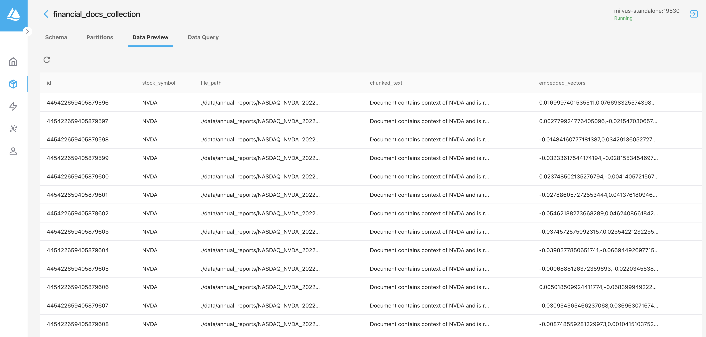

# Loading PDF Files into Milvus with Spark at Scale
In this repository, we will explore how to ingest and embed PDF files at scale using Spark for Retrieval Augmented Generation. We will walk through the steps required to set up the environment, install the necessary components, ingest PDF files into Milvus using Spark, and query the vector database for answers using OpenAI and Llama2.

## Introduction

Processing and analyzing large amounts of PDF files can be a challenging task. By leveraging the power of Spark, we can efficiently ingest and embed PDF files into Milvus, a vector database designed for similarity search and high-dimensional data storage. This enables us to perform fast and accurate queries on the embedded data, allowing for advanced retrieval and generation tasks.


## Environment Setup

To get started, we need to set up our environment. We assume you are using a Unix-based system, but the instructions can be adapted for Windows using WSL2 with Ubuntu 22.04. We install the required dependencies, including the Java Runtime Environment (JRE) and Python version 3.10 or above. Additionally, we install Docker and start the necessary containers using Docker Compose.

First, update the package list:

```bash
sudo apt update
```

Next, install the default Java Runtime Environment (JRE):

```bash
sudo apt install default-jre
```


Make sure you have Python version 3.10 or above installed. If not, you can install it using the following commands:

```bash
sudo add-apt-repository ppa:deadsnakes/ppa
sudo apt update
sudo apt install python3.10
```

You can verify your Python version using the command:

```bash
python3 --version
```

### Installing Required Infrastructure Components with Docker

To install the required infrastructure components, you need to have Docker installed. Run the following command to install Docker:

```bash
sudo apt-get install docker-ce docker-ce-cli containerd.io docker-buildx-plugin docker-compose-plugin
```

Once Docker is installed, you can start the required containers using the following command:

```bash
docker-compose -f ./docker-compose.yml up -d
```

> **_NOTE:_** If you encounter any permission errors while running the `docker-compose` command, try running the command multiple times. You can also try giving explicit permissions to the folder using `chmod`.

To confirm if all the containers are running properly, use the command:

```bash
docker ps
```

You should see the following containers listed:


Now, let's set up the Python environment. Activate your virtual environment and install the required Python packages:

```bash
python3 -m venv myenv
source myenv/bin/activate
pip install --upgrade pip
pip install -r requirements.txt
```

> **_NOTE:_** Before running any of the commands below, please rename `setup.env` to `.env` and provide the required API token (e.g., OpenAI) in the `.env` file.

### Setting Up the Collection in Milvus

To set up the collection in Milvus, run the following command:

```bash
python setup_milvus.py
```

### Ingesting the PDF Files Using Spark (Local Mode)

Once the environment is set up, we can proceed with ingesting the PDF files into Milvus using Spark. We provide instructions for ingesting a set of annual reports stored in the `./data/annual_reports` directory. Before running the ingestion routine, make sure to set the path to your Java home directory. Spark 3.4 supports Java 8, 11, and 17. 


```bash
export JAVA_HOME=<path to java home>
python3 pdf_ingestion.py
```
After the ingestion process is complete, we can verify the data in Milvus by accessing the Milvus UI in our browser.  If everything goes well, the data will be ingested into Milvus. You can check the collection by visiting [http://localhost:8000](http://localhost:8000) in your browser.



### Querying the Vector Database and Answering Using OpenAI

After ingesting the PDF files, we can query the vector database to obtain answers using OpenAI and Llama2. We provide instructions for running the query service with OpenAI and Llama2 separately. The OpenAI service utilizes a Gradio-based interface, allowing us to input queries based on the financial statements. Similarly, the Llama2 service provides a Gradio interface for querying with instructions tailored to that scenario.

To query the vector database and obtain answers using OpenAI, run the following command:

```bash
python3 qa_service_openai.py
```

This will open a Gradio-based interface. In your browser, go to [http://127.0.0.1:7860](http://127.0.0.1:7860) and try some queries based on the financial statements.


### Querying the Vector Database and Answering Using Llama2

This method uses a LLM hosting service called Replicate. Before running this command, make sure you have signed in to Replicate and have the required API token.

```bash
python3 qa_service_llama2.py
```

> **_NOTE:_** Before running this command, please rename `setup.env` to `.env` and provide the Replicate key.

A similar Gradio interface will be shown. The instructions to query mentioned above also apply to this scenario.

## Conclusion 

 We have demonstrated how to load PDF files into Milvus using Spark at scale. By leveraging the power of Spark, we efficiently ingest and embed PDF files into Milvus, enabling fast and accurate queries. We have also shown how to query the vector database using OpenAI and Llama2, providing a convenient interface for retrieving information from the embedded data. With these techniques, you can unlock the full potential of your PDF files and perform advanced retrieval augmented generation tasks.